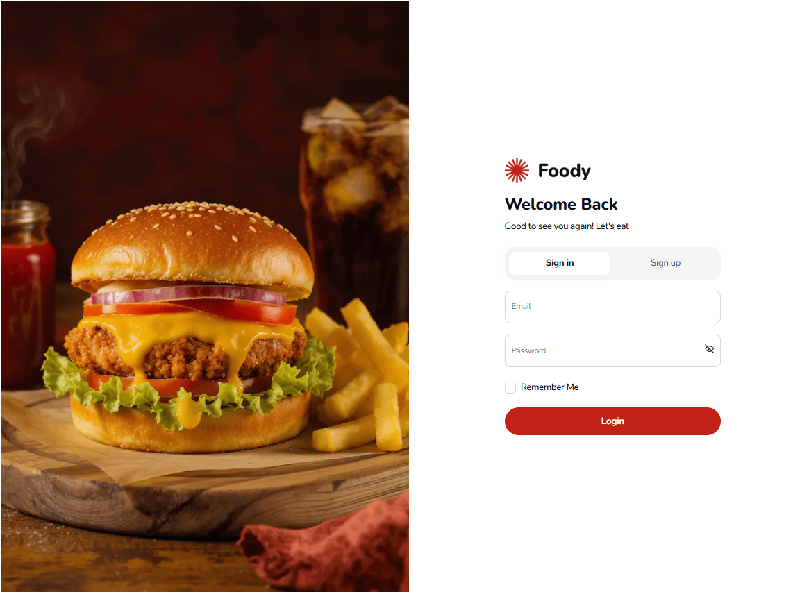
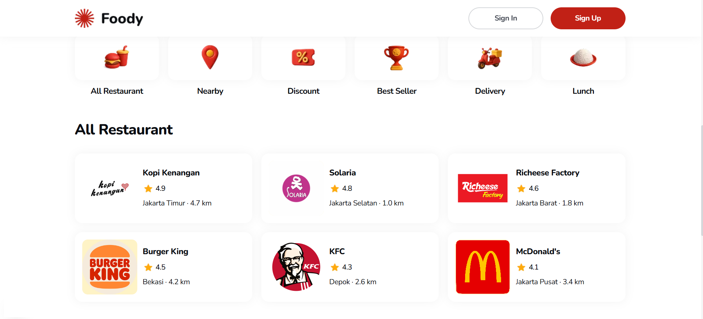
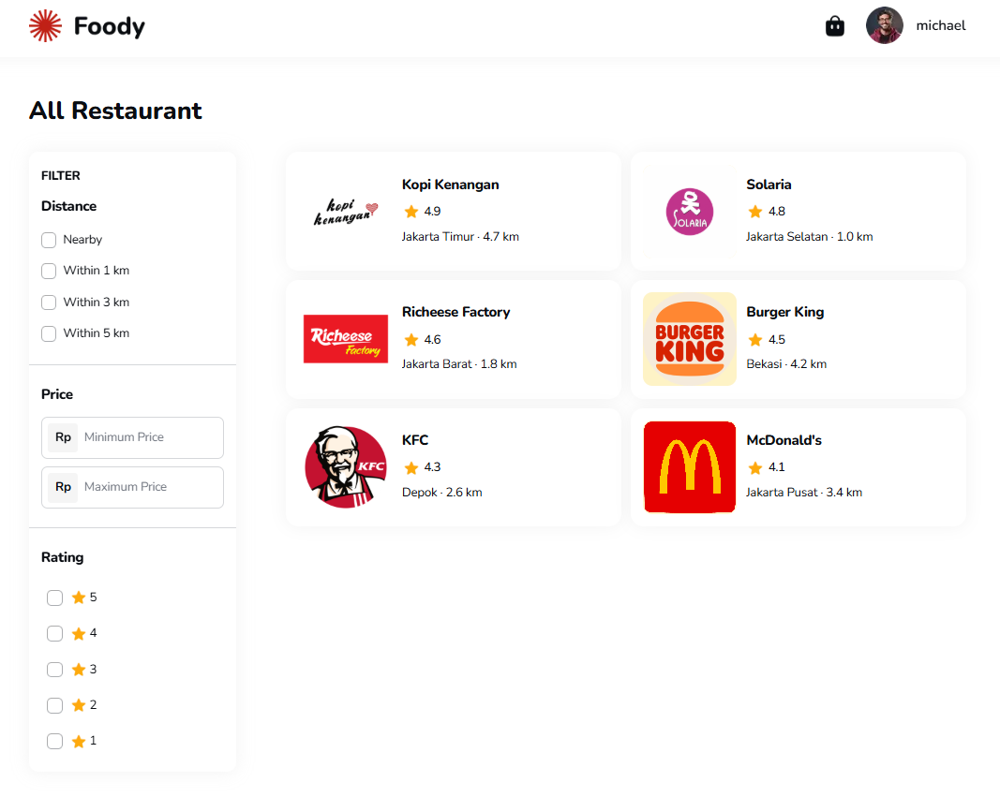
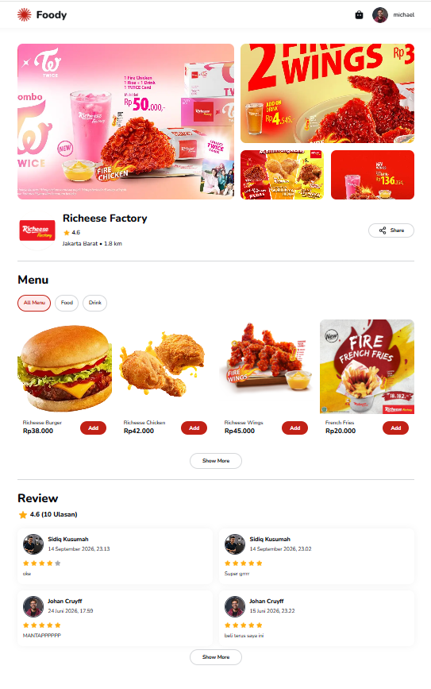
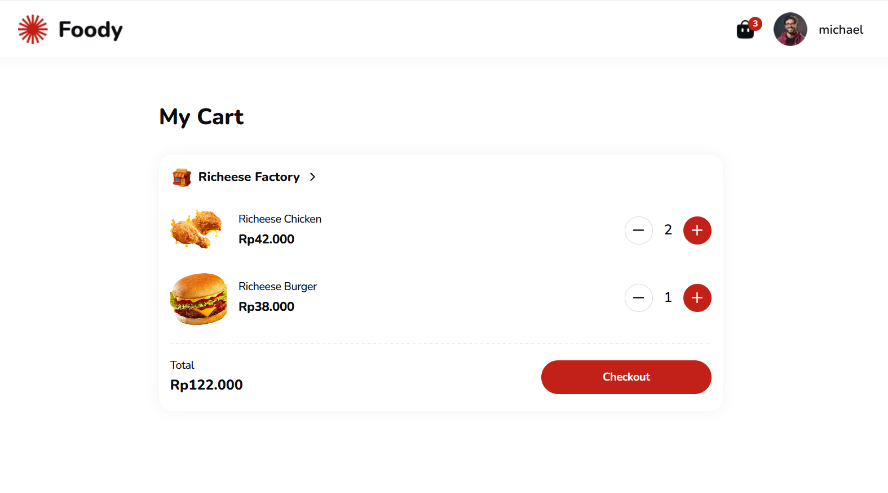
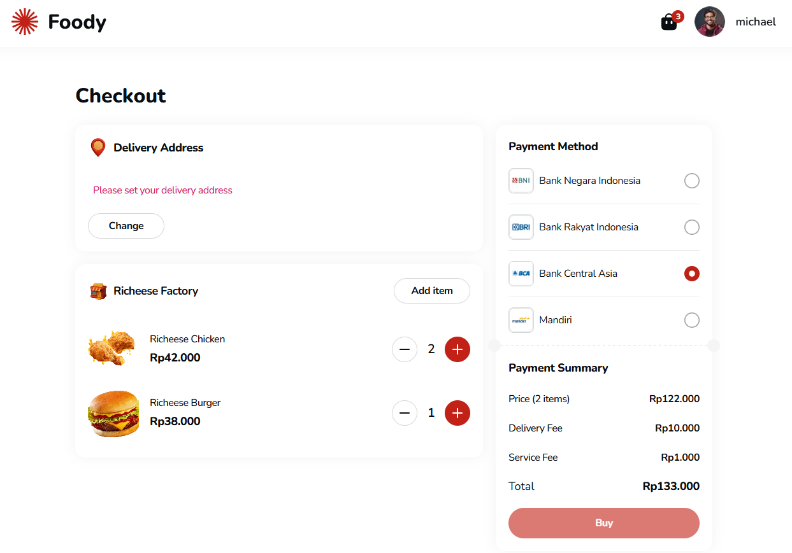
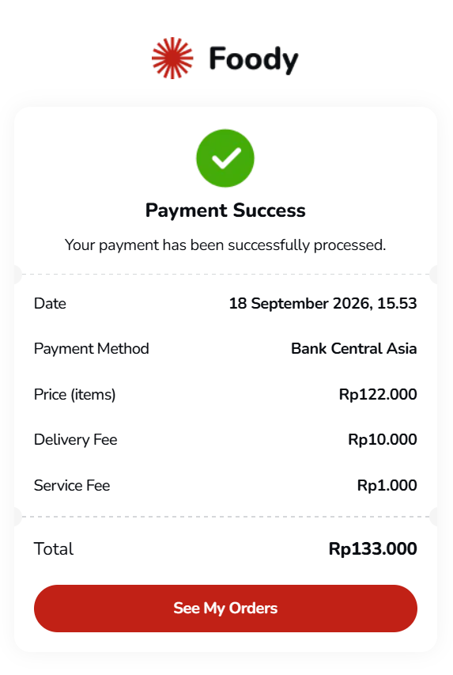
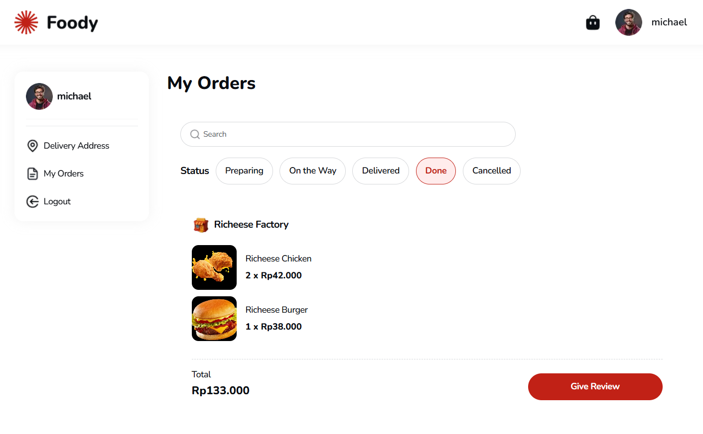

# Foody — Resto App

A full-featured restaurant ordering web app built with Next.js. Users can browse restaurants, filter and search by category/price/rating/distance, view menus and reviews, manage a cart, check out with multiple payment methods, and track order history.

**Live Demo:** [resto-app-by-yusuf-ar.vercel.app](https://resto-app-by-yusuf-ar.vercel.app/)


## Screenshots

|                                     Login                                     |                                     Home                                     |                                         Filter & Category                                          |
| :----------------------------------------------------------------------------: | :---------------------------------------------------------------------------: | :--------------------------------------------------------------------------------------------------: |
|  |  |  |

|                                       Restaurant Detail                                       |                                    Cart                                    |                                     Checkout                                     |
| :---------------------------------------------------------------------------------------------: | :---------------------------------------------------------------------------: | :---------------------------------------------------------------------------------: |
|  |  |  |

|                                      Payment Success                                      |                                   My Orders                                    |
| :-------------------------------------------------------------------------------------------: | :---------------------------------------------------------------------------: |
|  |  |

## Features

- **Auth** — register/login with token-based session, protected routes (cart, checkout, profile, orders) redirect to login when unauthenticated.
- **Browse & Discover** — home feed with recommended, best-seller and category sections; search by name.
- **Filter** — by category, price range, rating, and distance, synced to the URL so results stay shareable and survive a refresh.
- **Restaurant Detail** — menu grouped by food/drink, ratings, reviews, and a quantity stepper that stays in sync with the server cart.
- **Cart** — items grouped per restaurant, live quantity/price updates via TanStack Query.
- **Checkout** — delivery address, payment method selection, and an order summary with delivery/service fees.
- **Order History** — filterable by status (preparing, on the way, delivered, done, cancelled), with the ability to leave a review after delivery.
- **Profile** — update name, phone, avatar, and delivery address.

## Tech Stack

| Layer               | Tools                                       |
| ------------------- | -------------------------------------------- |
| Framework           | Next.js 15 (App Router)                      |
| Language            | TypeScript                                   |
| Server state        | TanStack Query                               |
| Client/UI state     | Zustand                                      |
| Forms & validation  | React Hook Form + Zod                        |
| HTTP client         | Axios                                        |
| UI primitives       | Radix UI                                     |
| Styling             | Tailwind CSS                                 |
| Animation           | Framer Motion                                |

## Getting Started

### Prerequisites

- Node.js 18.18+
- npm

### Installation

```bash
git clone https://github.com/Yusuf-98/Resto-App-by-Yusuf-AR.git
cd Resto-App-by-Yusuf-AR
npm install
```

### Environment Variables

Copy `.env.example` to `.env.local` and fill in the API base URL:

```bash
cp .env.example .env.local
```

| Variable                     | Description                          |
| ----------------------------- | ------------------------------------- |
| `NEXT_PUBLIC_API_BASE_URL`   | Base URL of the backend REST API      |

### Run

```bash
npm run dev      # start dev server at http://localhost:3000
npm run build    # production build
npm run start    # run the production build
npm run lint     # run ESLint
```

## API

This app consumes a REST API for restaurants, cart, orders, reviews, and auth. See the [Swagger docs](https://be-restaurant-production.up.railway.app/api-swagger/) for the full contract.

## License

Licensed under the [MIT License](LICENSE).
