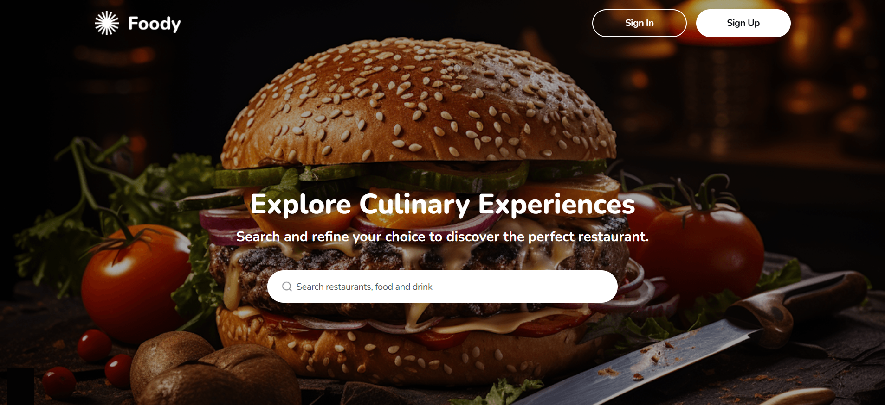
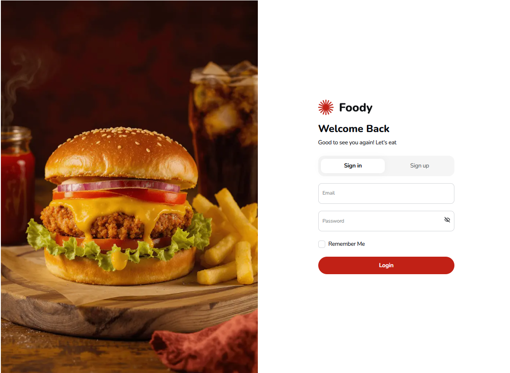
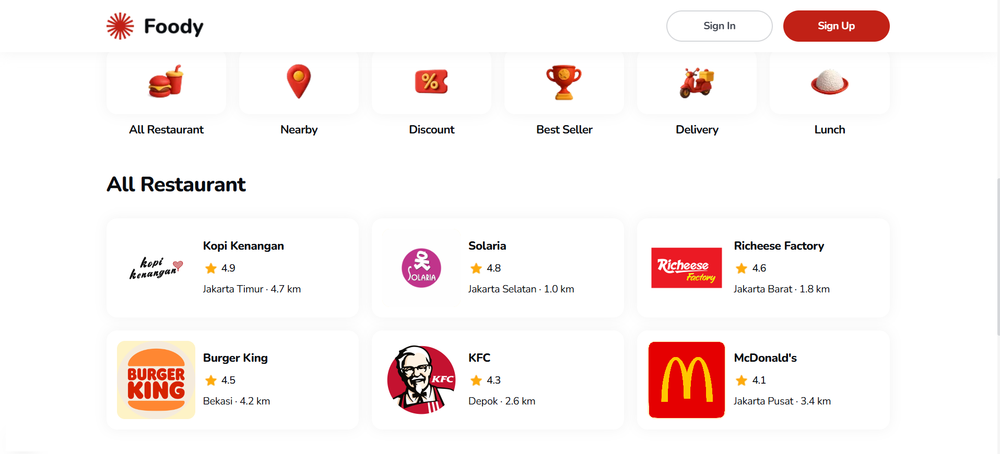
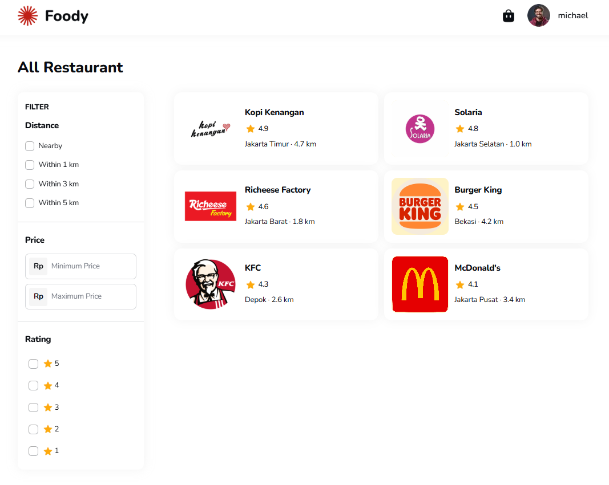
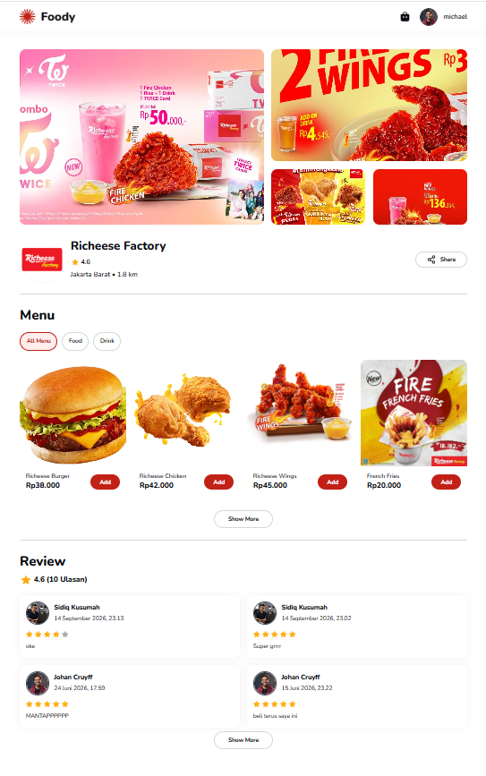
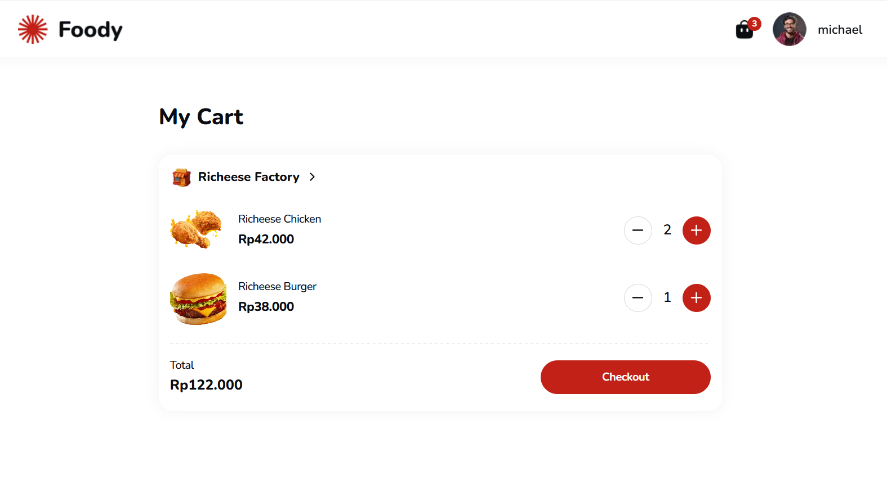
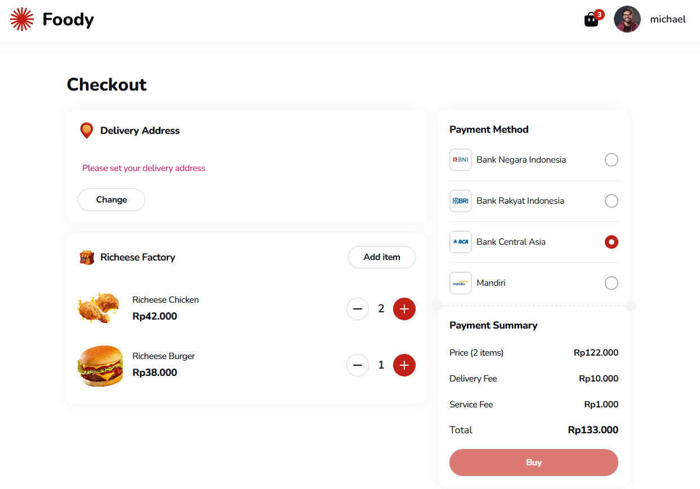
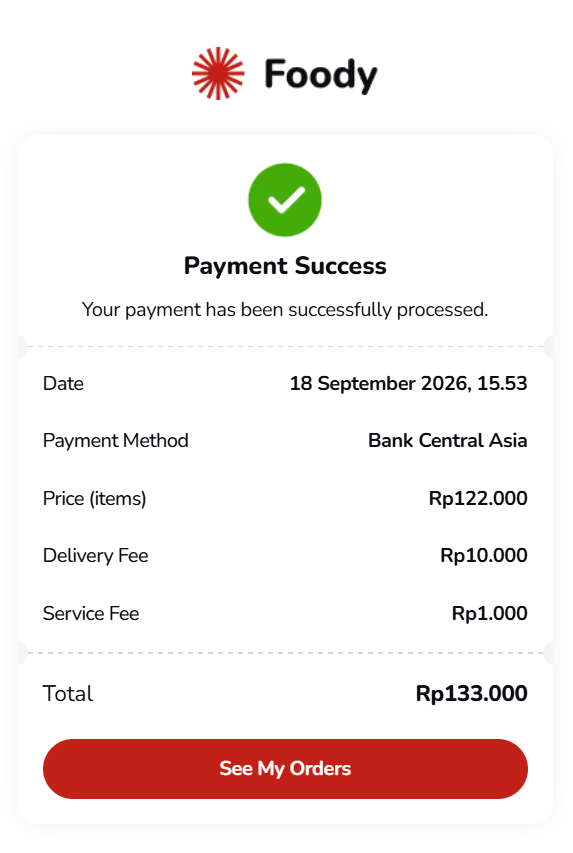
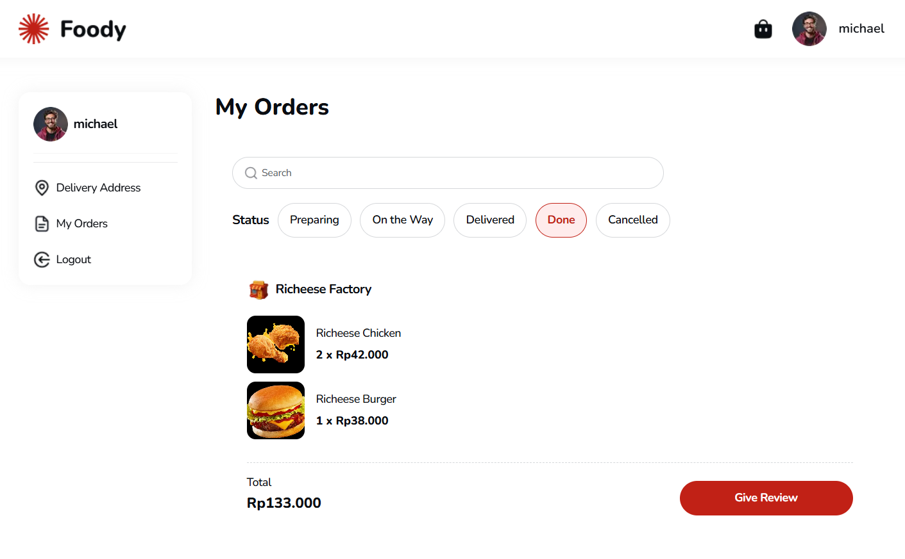

# Foody — Resto App

[](https://github.com/Yusuf-98/Resto-App-by-Yusuf-AR/actions/workflows/ci.yml)

A restaurant ordering web app: browse restaurants, filter and search by category, price, rating or distance, view menus and reviews, manage a cart, check out with a delivery address and payment method, and track order status.

Built with Next.js (App Router), TypeScript and Tailwind CSS against a separate REST API. The interface targets an Indonesian audience, so prices, dates and toast/validation messages are in Indonesian.

🚀 **Live demo:** https://resto-app-by-yusuf-ar.vercel.app/

Register an account to try the cart, checkout and order history; browsing, search and restaurant detail pages work without logging in.

<p align="center">
  
</p>

[](#performance)


## Features

- **Auth** — register/login with a token-based session; protected routes (cart, checkout, profile, orders) redirect to login when unauthenticated
- **Browse and discover** — home feed with recommended, all-restaurant and category sections; search by name
- **Filter** — by category, price range, rating and distance, synced to the URL so results stay shareable and survive a refresh
- **Restaurant detail** — menu grouped by food/drink, ratings, reviews, and a quantity stepper kept in sync with the server cart
- **Cart** — items grouped per restaurant, live quantity/price updates via TanStack Query
- **Checkout** — delivery address, payment method selection, and an order summary with delivery/service fees
- **Order history** — filterable by status (preparing, on the way, delivered, done, cancelled), with the ability to leave a review after delivery
- **Profile** — update name, phone, avatar and delivery address

## Screenshots

| | |
| --- | --- |
|  |  |
| **Login** — token-based auth | **Home** — recommended feed and categories |
|  |  |
| **Filter and category** — price, rating and distance, synced to the URL | **Restaurant detail** — menu, ratings and reviews |
|  |  |
| **Cart** — grouped per restaurant | **Checkout** — address, payment method, fee summary |
|  |  |
| **Payment success** | **My orders** — filterable by status |

## Tech stack

- **Next.js 15** (App Router) + **TypeScript** + **Tailwind CSS**
- **TanStack Query** for server state (fetching, caching, mutations)
- **Zustand** for auth and client UI state
- **React Hook Form** + **Zod** for forms and validation
- **Axios** for the API client
- **Radix UI** for the accessible toast primitive
- **Framer Motion** for the restaurant detail image slider
- **Vitest** + **React Testing Library** for tests, **GitHub Actions** for CI

## Getting started

Requires Node.js 22 or newer.

```bash
git clone https://github.com/Yusuf-98/Resto-App-by-Yusuf-AR.git
cd Resto-App-by-Yusuf-AR
npm install
cp .env.example .env.local
```

Fill in the backend URL in `.env.local`:

| Variable | Description |
| --- | --- |
| `NEXT_PUBLIC_API_BASE_URL` | Base URL of the backend REST API |

Then start the dev server and open `http://localhost:3000`:

```bash
npm run dev
```

| Command | Description |
| --- | --- |
| `npm run dev` | Start the Next.js dev server |
| `npm run build` | Production build, then defers the home page's app scripts ([defer-scripts.mjs](scripts/defer-scripts.mjs)) |
| `npm run start` | Run the production build |
| `npm run lint` | Run ESLint |
| `npm run typecheck` | Type-check only |
| `npm run test` | Run tests in watch mode |
| `npm run test:run` | Run the test suite once |

## Testing

Tests live next to the code they cover (`*.test.ts` / `*.test.tsx`) and run with Vitest and React Testing Library in jsdom. They target interactive logic rather than static markup:

- **Formatting and validation**: currency, date (always in Jakarta time regardless of the machine's timezone), distance and order-status label utilities; the login, register, checkout and review Zod schemas.
- **Auth store**: token/user persistence, partial profile updates, logout, and the "Remember Me" switch between `localStorage` and `sessionStorage`.
- **Login and register forms**: validation errors, the password-visibility toggle, and both the success (login/redirect) and failure (rejected credentials, mismatched confirm-password, invalid phone) paths.
- **Accessibility**: the shared modal hook (scroll lock, focus trap, focus return, Escape to close) and the fade-in entrance animation (scroll-triggered reveal, eager-on-paint items, staggered delay, and that it never replays).
- **Toasts**: a toast appears immediately, auto-dismisses on its timeout, and stops notifying an unmounted hook.
- **UI primitives**: the floating-label `Input`, including error state and a pre-filled controlled value.

GitHub Actions runs lint, type-check, tests and the production build on every push and pull request ([ci.yml](.github/workflows/ci.yml)).

## Performance

Lighthouse results for the [live site](https://resto-app-by-yusuf-ar.vercel.app/): the median of 10 mobile and 6 desktop runs on 7 October 2026 (Lighthouse 13.5.0).

| | 📱 Mobile | 🖥️ Desktop |
| --- | :---: | :---: |
| **Performance** | **98** | **100** |
| **Accessibility** | **100** | **100** |
| **Best practices** | **100** | **100** |
| **SEO** | **100** | **100** |

Mobile performance ranged from 94 to 99 across the 10 runs; desktop scored 100 in all 6.

### Core metrics

| Metric | 📱 Mobile | 🖥️ Desktop | Good if |
| --- | :---: | :---: | :---: |
| **First Contentful Paint** (first pixels) | 🟢 1.0 s | 🟢 0.4 s | ≤ 1.8 s |
| **Largest Contentful Paint** (main content visible) | 🟢 1.4 s | 🟢 0.5 s | ≤ 2.5 s |
| **Total Blocking Time** (page unresponsive) | 🟢 165 ms | 🟢 14 ms | ≤ 200 ms |
| **Cumulative Layout Shift** (content jumping) | 🟢 0 | 🟢 0 | ≤ 0.1 |

🟢 within Google's "good" range · figures are medians

### What "mobile" means in this test

The mobile test does not simply run on a fast laptop. Lighthouse slows the machine down to imitate a mid-range phone on a weak connection:

- **Device**: a Moto G Power (2022), 412 × 823 px screen at 1.75× pixel density.
- **Network**: simulated slow 4G, about **1.6 Mbps** download with **150 ms** of round-trip latency.
- **CPU**: slowed down **4×**, so JavaScript takes four times as long to run as it does on the laptop.

Run it yourself with [PageSpeed Insights](https://pagespeed.web.dev/analysis?url=https%3A%2F%2Fresto-app-by-yusuf-ar.vercel.app%2F&form_factor=mobile) or `npx lighthouse https://resto-app-by-yusuf-ar.vercel.app/ --form-factor=mobile`. A single run can move by several points with network and CPU conditions, which is why the figures above are medians.

### How it stays fast

- **App scripts after the hero**: the home page is prerendered, so its first screen needs no JavaScript to appear. A post-build step ([defer-scripts.mjs](scripts/defer-scripts.mjs)) moves the page's script tags out of the HTML and into a small inline loader that adds them once the hero image has loaded and painted, so the hero no longer competes with about 190 KB of JavaScript for bandwidth. If the hero image fails, the scripts load after 3 seconds anyway.
- **Hero image** is served as WebP through `next/image`, preloaded with `fetchpriority="high"` from the top of the `<head>`. WebP decodes in a fraction of the time AVIF needs, so the first frame isn't held back by image decoding.
- **No Node polyfills in the browser**: the `Buffer` polyfill Next.js injects by default is dropped from the client build, since nothing in the app uses it.
- **Auth store**: components subscribe only to the fields they read, so restoring the session from storage doesn't re-render the navbar or restaurant list for logged-out visitors.
- **Font**: the body font is self-hosted and subset to only the characters the app actually uses, dropping unused glyphs and metadata tables — 39 KB down to 22 KB, with no visual difference (verified with a pixel diff across every page and breakpoint).
- **Restaurant list**: not fetched at all on first load. It only requests data once the section is about to enter the viewport (`IntersectionObserver`), so a visit that never scrolls makes zero calls to the restaurant API.
- **Category tiles**: excluded from the page's initial hydration and loaded in a separate chunk right after the main content settles, the same pattern used for the toast library below.
- **React Compiler** auto-memoizes components at build time, so fewer parts of the tree re-render than a hand-written app would produce without it.
- **Motion**: the hero, title and search bar fade in immediately; everything below the fold fades in as it scrolls into view, once, without replaying.
- **Toaster**: mounted eagerly rather than behind a dynamic import — measured to be faster in this app, since a component that renders nothing until a toast fires gains nothing from its own separate chunk request.

## API

The app talks to a separate REST API (Node/Express). It publishes an OpenAPI/Swagger document, but the summary below is what this frontend actually relies on. Paths are relative to `NEXT_PUBLIC_API_BASE_URL`.

- **Envelope**: responses are `{ success, message, data }` on success and `{ success: false, message, errors }` on failure. The API client unwraps `data`; a non-2xx response throws with the status and parsed body attached.
- **Auth**: `POST /api/auth/login` and `POST /api/auth/register` both return `{ user, token }`; the token is sent as `Authorization: Bearer <token>`. A `401` logs the user out.
- **Pagination**: list endpoints take `page` and `limit` (capped at 50 server-side) and return a `pagination` object alongside the data.

| Area | Endpoints used |
| --- | --- |
| Auth | `POST /api/auth/register`, `POST /api/auth/login`, `GET /api/auth/profile`, `PUT /api/auth/profile` |
| Restaurants | `GET /api/resto` (`category`, `priceMin`, `priceMax`, `rating`, `range`), `GET /api/resto/:id`, `GET /api/resto/search`, `GET /api/resto/best-seller`, `GET /api/resto/recommended` |
| Cart | `GET /api/cart`, `POST /api/cart`, `PUT /api/cart/:id`, `DELETE /api/cart/:id`, `DELETE /api/cart` |
| Orders | `POST /api/order/checkout`, `GET /api/order/my-order` (`status`, `page`, `limit`) |
| Reviews | `POST /api/review`, `GET /api/review/my-reviews`, `GET /api/review/restaurant/:id` |
| Profile | `PUT /api/auth/profile` (multipart when the avatar changes) |

The seed data has no real coordinates or delivery-radius fields, so the "Nearby", "Discount", "Delivery" and "Lunch" category filters are UI-only for now — they don't narrow the restaurant list.

## Project structure

```
scripts/
└── defer-scripts.mjs   # Post-build step: loads the home page's scripts after the hero paints
src/
├── app/
│   ├── (auth)/         # Login, register — no navbar/footer
│   └── (main)/         # Everything behind the main layout
│       ├── (home)/     # Home feed
│       ├── category/   # Filterable restaurant list
│       ├── resto/[id]/ # Restaurant detail
│       ├── cart/
│       ├── checkout/
│       ├── orders/
│       └── profile/
├── components/
│   ├── features/       # Page-specific blocks, grouped by domain
│   ├── shared/          # Navbar, footer, cards, skeletons, shared hooks' UI
│   └── ui/              # Small UI primitives (button, input, toast)
├── hooks/
│   └── queries/        # TanStack Query hooks, grouped by resource
├── lib/
│   ├── api/             # REST calls grouped by resource
│   ├── validations/     # Zod schemas
│   └── ...              # API client, utils, image-host allowlist
├── store/               # Zustand auth store
└── types/                # Shared types (Restaurant, Order, Review, ...)
```

## Deployment

Deployed on Vercel with zero extra config — static and dynamic routes are detected automatically from the App Router, and Vercel's default `npm run build` already includes the post-build script step. Set `NEXT_PUBLIC_API_BASE_URL` in the Vercel project's environment variables. Remote restaurant/avatar images are only optimized through `next/image` for hosts listed in [`src/lib/image-hosts.ts`](src/lib/image-hosts.ts) (Cloudinary and Unsplash); add a host there before pointing the API at a new image source.

## Author

Built by [Yusuf AR](https://github.com/Yusuf-98).

## License

Licensed under the [MIT License](LICENSE).
